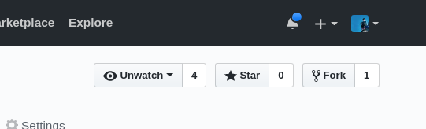

### Code Ramp - Plataforma 5

# Java Script Deep Dive

En este modulo vamos a ver lo fundamentos sobre los que se basa JavaScript, con ellos vamos a ganar un mejor entendimiento del funcionamiento de las herramientas que el lenguaje nos provee.

Pero no solo vamos a trabajar con teoría, le vamos a agregar ejercicios para que ustedes hagan y puedan testear.

Los ejercicios van a estar planteados no como enunciados ordinarios, si no que van a obtener los objetivos de los ejercicios a partir de `tests`.

## Setup

Primero que nada van a tener que hacer un `fork` de este repositorio subido a GitHub, un fork es una copia del repo entero pero bajo nuestro propio usuario, de esta manera podemos modificarlo a gusto sin repercutir en el original.

Hagan click en el boton de `fork` arriba a la derecha.

Una vez terminado vamos a estar en un nuevo repo de nuestra pertenencia, vamos a `clonar` dicho repositorio a nuestra computadora con lo que aprendimos en el modulo de [_git_](http://bootcamp.plataforma5.la/modules/0996821f-58f2-4d46-9fb1-c00401ce2371/contents/a49b5bce-7b21-48a9-9191-01c9a98d0969).
Cuando lo tengamos en un repositorio local, vamos a trabajar directamente en su editor de texto. Vayan avanzando en cada modulo del JSDeepDive de manera ordenada leyendo primero la teoría y luego avanzando a los Spec.

* [Usando Test](./00-ProbandoTests/)
* [Tipos de Datos y Objetos (Repaso)](./01-Objetos/)
* [JavaScript Teorico](./02-JsTeorico/)
* [Intro a Functions](./03-Funciones1/)
* [Advanced Functions and Closures](./04-Funciones2)
* [Constructores](./05-Constructores)
* [Prototypal Inheritance](./06-Prototype)
* [Functional Programing](./07-ParadigmaFunctional)
* [Recursion](./08-Recursion)
